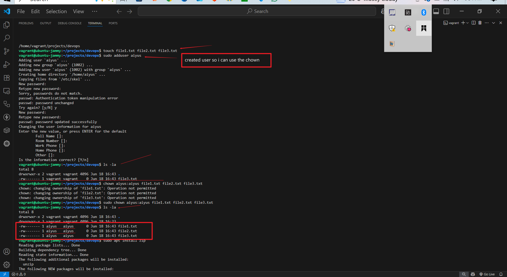

# Vagrant Linux Server Setup and Basic Operations

This project demonstrates setting up an Ubuntu server using Vagrant, exploring the Linux file system, managing file permissions, installing packages, and testing network connectivity.

## 1. Vagrant Server Setup

**Description:**  
Initialized a new Ubuntu 22.04 (Jammy Jellyfish) VM using Vagrant with VirtualBox provider. The `vagrant up` command downloaded the specified box version (20241002.0.0) and started the VM. Successfully SSH'd into the machine using `vagrant ssh`.

## 2. Exploring Linux File System

**Structure Created:**  
/home/vagrant/projects/devops/

text
Created a nested directory structure under the vagrant user's home directory for organizing development projects. Used `mkdir -p` to create parent directories as needed.

## 3. File Permissions and Ownership

**Explanation:**  
- Created three empty files (file1.txt, file2.txt, file3.txt)
- Changed ownership to user `aiyus` and group `aiyus` using `sudo chown`
- Permission `-rwx------` (700) means:
  - 1 = x-execute
  - 2 = w-write
  - 4 = r-read
  : 1+2+4 = 7
  - Owner (aiyus) has read,write and execute
  - Group and others have no permissions

## 4. Package Installation

**Actions:**  
- Installed `zip` and `unzip` packages using `apt`
- Verified installation with `zip --version`
- The output shows zip version 3.0 with compilation options and copyright information

## 5. Remote Connectivity Test

**Results:**  
- Successfully pinged google.com with average RTT of 133ms
- 0% packet loss indicates stable network connection
- Useful for verifying:
  - Internet connectivity from VM
  - DNS resolution
  - Network latency 